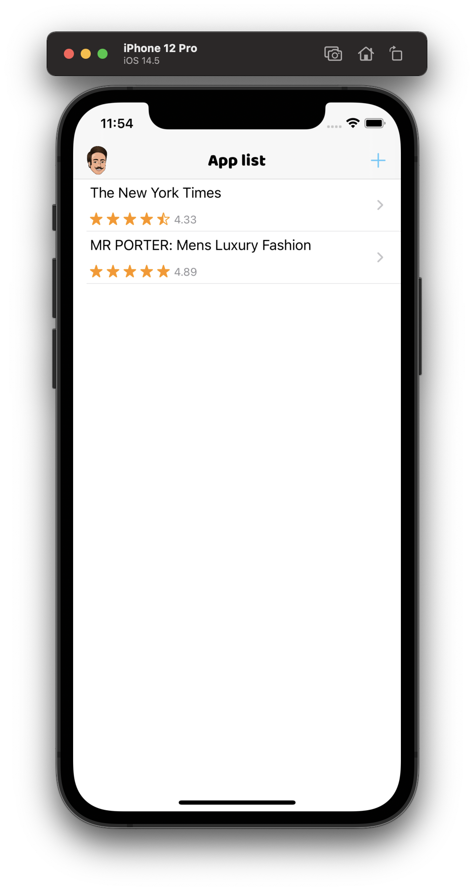
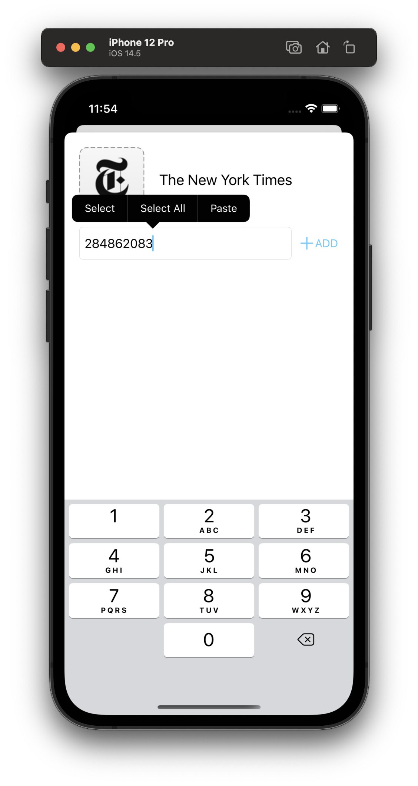
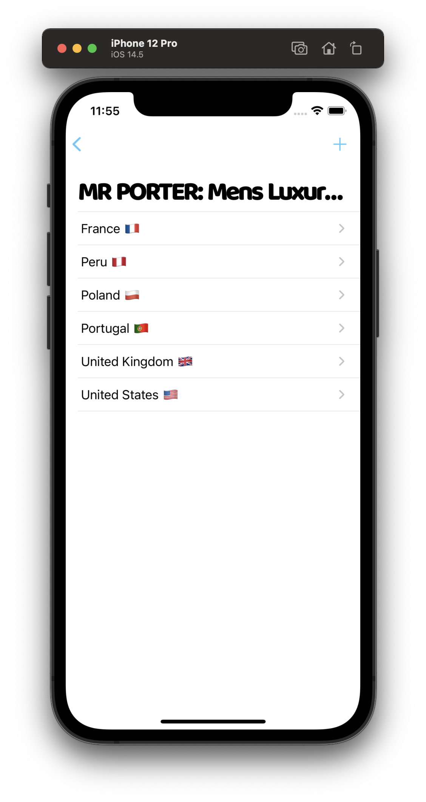
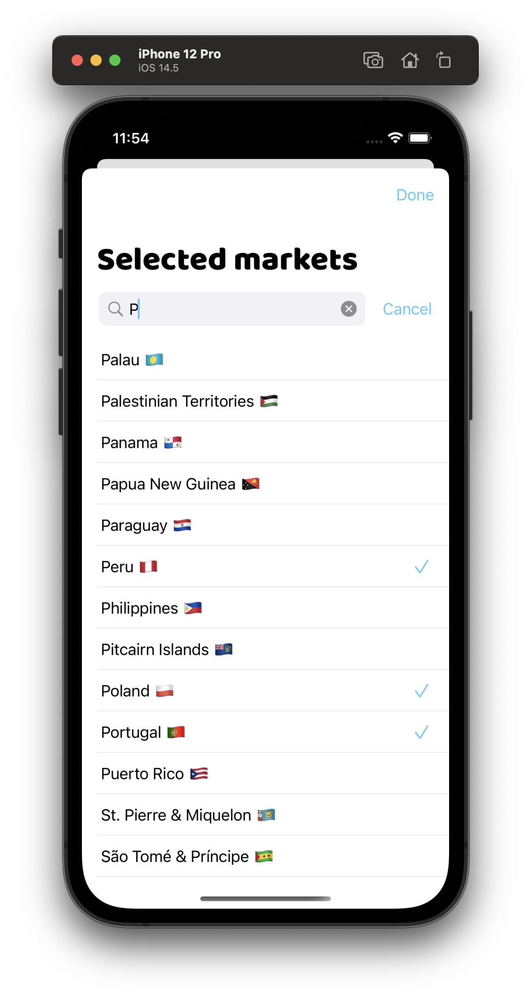
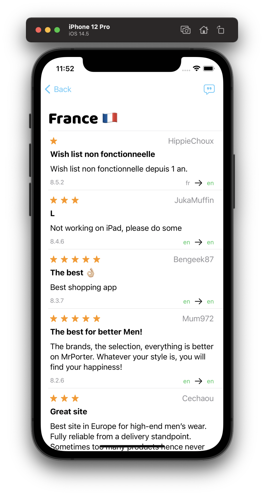

## Purpose
This is a small app that fetchs the App Store reviews data via iTunes APIs.
Its purpose is to consolidate all app reviews coming from different markets (countries) and translate the reviews in English.

As people from different cultures interact with apps differently, BURT also offers rating average and sentiment analysis for each market to identify in which market the app is underperforming.

## Screenshots

## Technical exploration
I used this app to get more understanding and experience to technologies or patterns that I didn't use much in a professional setting.  
This includes:
- SwiftUI
- UIKit ViewController integration to SwiftUI
- CoreData modern APIs
- Dogfooding the [Envol](https://github.com/MathieuPerrais/Envol) library
- Dark mode support and theme handling with UIAppearance
- Sentiment analysis with CoreML
- Translations via Xliff